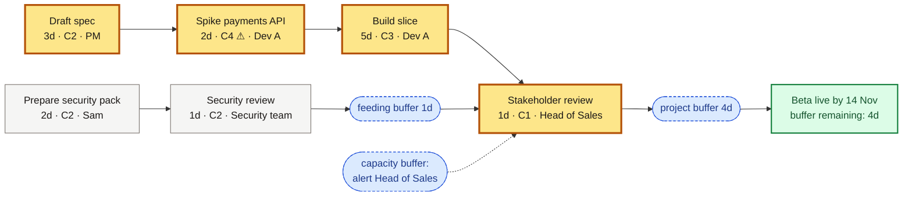

# Critical Chain — diagrams

## Contents

- Prefer Miro
- Mermaid conventions
- Local HTML fallback
- Validation
- Fixture

## Prefer Miro

Display and edit the chain as Mermaid on a **Miro** board via the [Miro MCP server](https://developers.miro.com/docs/miro-mcp) (create, read, update).

1. If Miro MCP is not connected, suggest the human installs the Miro connector for their agent (for example the Miro plugin for ChatGPT) and signs in to their Miro team.
2. Create or update the diagram on the board they choose; share the board or diagram link while iterating.
3. Prefer Miro over local files for live facilitation.
4. Validate by confirming the diagram is on the board and the Mermaid can be read back via MCP.

Mermaid is the source format either way; the conventions below apply to Miro and local files alike.

## Mermaid conventions

Use `flowchart LR`: steps run left to right in dependency order, ending at the goal on the right. Arrows mean "must finish before": `A --> B` means A finishes before B can start.

Include this block once, near the top:

```mermaid
classDef chain fill:#FDE68A,stroke:#B45309,stroke-width:3px,color:#1c1917
classDef feed fill:#F5F5F4,stroke:#78716C,color:#1c1917
classDef buffer fill:#DBEAFE,stroke:#1D4ED8,stroke-dasharray:4 3,color:#1e3a8a
classDef goal fill:#DCFCE7,stroke:#15803D,stroke-width:2px,color:#14532d
```

| Class | Use for |
| --- | --- |
| `:::chain` | Steps on the critical chain (amber, thick border) |
| `:::feed` | Steps on feeding chains (neutral) |
| `:::buffer` | Project, feeding, and capacity buffers (blue, dashed, rounded) |
| `:::goal` | The goal and its date (green) |

**Step labels:** name, then duration · complexity rating · who, e.g. `Build slice<br/>5d · C3 · Dev A`. Add `⚠` after a 4 or 5 rating so discovery risk stands out: `C4 ⚠`. Never label people as "resources".

**Buffers:** rounded nodes (`(["…"])`) with the buffer type and size:

- Project buffer: between the last chain step and the goal.
- Feeding buffer: between the last feeding step and the chain step it joins.
- Capacity buffer: a dotted arrow (`-.->`) to the chain step whose scarce person it alerts. It is a warning, not time, so it sits beside the chain rather than in it.

**Buffer remaining:** show it in the goal label at each revisit, e.g. `Beta live by 14 Nov<br/>buffer remaining: 3d`.

Write one link per line where you can; it keeps edits and reviews simple.

Example:



When working locally, keep the live `.mmd` file wherever the human wants session work to live (for example a `.scratch/` folder in their project), next to the viewer output.

## Local HTML fallback

Use only when Miro MCP is unavailable (offline, no sign-in, automated checks).

From this skill's directory:

```bash
node scripts/write-chain-viewer.mjs <diagram.mmd> <output.html>
```

The script copies `scripts/chain-viewer-template.html` and injects the Mermaid source. To do it by hand, copy the template and replace the `__MERMAID_SOURCE__` placeholder with the diagram.

Open the HTML in a browser and confirm the page shows **Diagram rendered**. If Mermaid fails, the page shows **Diagram failed**: fix the source and reload.

## Validation

- **Miro:** the diagram is visibly on the board, and the agent can read the Mermaid back via MCP.
- **Local:** do not call a diagram done until a browser shows **Diagram rendered**.

## Fixture

Sample chain: `fixtures/sample-chain.mmd`. From this skill's directory:

```bash
node scripts/write-chain-viewer.mjs fixtures/sample-chain.mmd /tmp/cc-sample-viewer.html
```

Open `/tmp/cc-sample-viewer.html` and confirm **Diagram rendered**.
