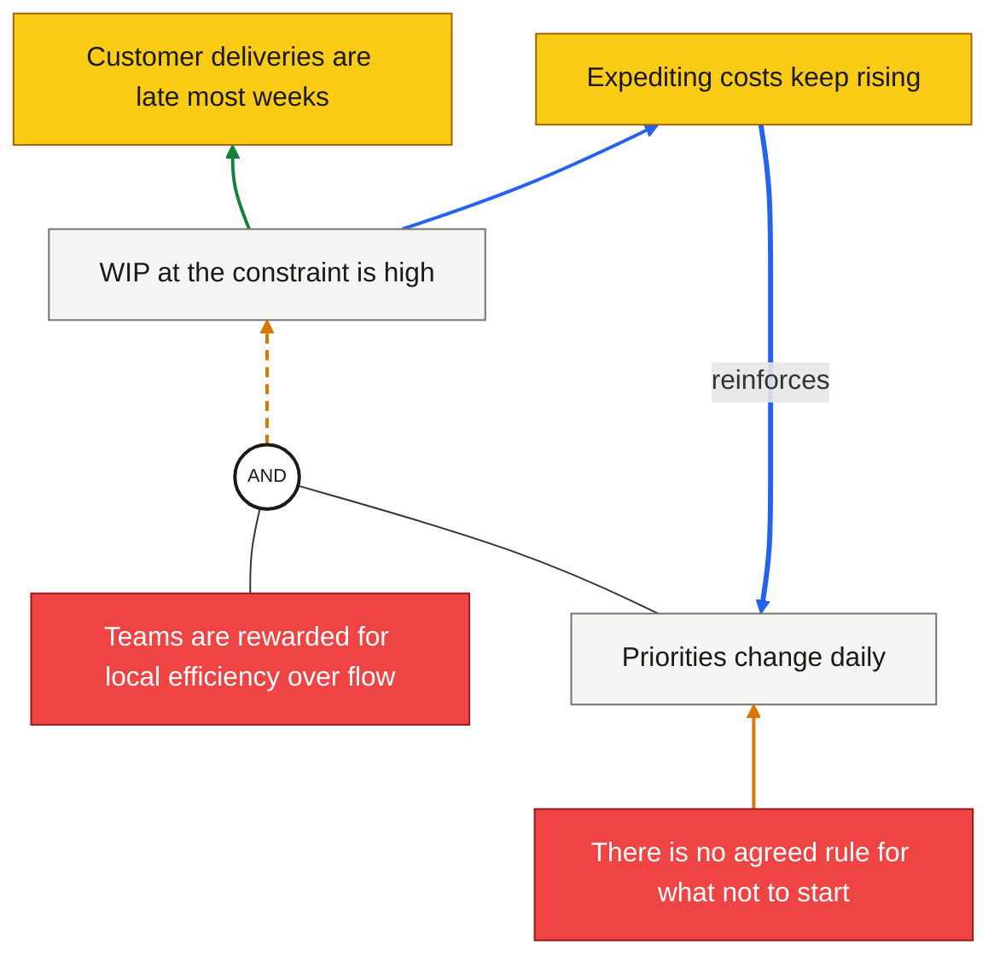

# CRT diagram conventions

Mermaid is the source format, whether the diagram lives on a Miro board or in a local HTML viewer. Keep the source editable and readable: the agent and the human will both revise it.

## Contents

- Layout and node classes
- AND junctions
- Arrow styles: evidence, grade, loops
- Evidence comments
- Full example
- Legend

## Layout and node classes

Use `flowchart BT` (bottom to top) so root causes sit at the bottom and UDEs at the top. Include this block once, near the top:

```mermaid
classDef ude fill:#FACC15,stroke:#A16207,color:#1c1917
classDef rootCause fill:#EF4444,stroke:#991B1B,color:#ffffff
classDef mid fill:#F5F5F4,stroke:#78716C,color:#1c1917
classDef andJunction fill:#ffffff,stroke:#1c1917,stroke-width:2px,color:#1c1917,font-size:11px
```

| Class | Use for |
| --- | --- |
| `:::ude` | Undesirable effects (yellow) |
| `:::rootCause` | Root causes (red). Don't name the class `root`; it clashes with Mermaid internals |
| `:::mid` | Every other entity (neutral) |
| `:::andJunction` | AND junction nodes |

Write each entity label as one complete sentence. Keep evidence types, grades, and sources off the label (see Evidence comments).

## AND junctions

When two or more causes produce an effect only together, join them at a small AND node, then draw one arrow from the junction to the effect:

```mermaid
A1((AND)):::andJunction
CauseA --- A1
CauseB --- A1
A1 --> Effect
```

The `---` lines carry no arrowhead: the causal claim is the single `A1 --> Effect` arrow, and that is the arrow you style and grade.

An **additional cause** (one that can produce the effect alone) gets its own `-->` arrow straight to the effect, with no junction.

## Arrow styles: evidence, grade, loops

Arrow **colour** shows the evidence type of the causal claim:

| Evidence type | Colour | Style line |
| --- | --- | --- |
| Observed | green | `stroke:#15803D,stroke-width:2px` |
| Reported | blue | `stroke:#2563EB,stroke-width:2px` |
| Inferred | amber | `stroke:#D97706,stroke-width:2px` |
| Assumption | grey | `stroke:#78716C,stroke-width:2px` |

Arrows graded **weak** in the read-aloud sweep add `stroke-dasharray:6 4` (dashed).

**Vicious-cycle** arrows use Mermaid's thick arrow `==>` and a short label, e.g. `UDE1 ==>|reinforces| MID2`. They still take an evidence colour.

Mermaid styles arrows by **position**: `linkStyle 0` is the first link written in the source, `linkStyle 1` the second, and so on. Every link counts, including the `---` lines into AND junctions and each hop of a chained line like `A --> B --> C`. To keep indexes reliable:

- Write one link per line.
- Put all `linkStyle` lines at the end of the source.
- Number links in the evidence comments (`L0`, `L1`, …) so they match the `linkStyle` indexes.
- Leave the `---` junction lines unstyled (they use the default neutral colour).
- After adding or removing a link, re-check every index below it.

## Evidence comments

Record evidence for entities and arrows as Mermaid comments (`%%`), which never appear on the picture:

```mermaid
%% N MID1: observed — WIP board photo, 3 Oct
%% L4 MID1-->UDE1: reported (ops lead), grade plausible
%% L5 MID2-->MID1: inferred, grade weak — check with planners
```

Each comment states: what it describes, the evidence type, the source when known, and (for arrows) the sweep grade. Assumptions under an arrow go here too: `%% L5 assumes: planners don't see WIP before re-prioritising`.

## Full example



## Legend

The local HTML viewer prints a legend for node colours and arrow styles. On Miro, add a small legend note beside the diagram with the same entries: yellow = UDE, red = root cause, green / blue / amber / grey arrow = observed / reported / inferred / assumption, dashed = weak link, thick = vicious cycle.
