# Flow and Constraints — diagrams

## Contents

- Prefer Miro
- When to skip a diagram
- Mermaid conventions
- Local HTML fallback
- Validation
- Fixture

## Prefer Miro

Display and edit the flow map as Mermaid on a **Miro** board via the Miro MCP server (create, read, update) when a diagram helps.

1. If Miro MCP is not connected, suggest the human installs the Miro connector for their agent and signs in to their Miro team.
2. Create or update the diagram on the board they choose; share the board or diagram link while iterating.
3. Prefer Miro over local files for live facilitation.
4. Validate by confirming the diagram is on the board and the Mermaid can be read back via MCP.

Mermaid is the source format either way; the conventions below apply to Miro and local files alike.

## When to skip a diagram

A structured **flow outline** alone is a valid finish for this skill. Draw a diagram when it helps the group see waits, queues, and the named constraint — not as a mandatory artefact.

## Mermaid conventions

Use `flowchart LR`: work flows left to right from desire/intake toward validated outcome.

Include this block once, near the top:

```mermaid
classDef step fill:#F5F5F4,stroke:#78716C,color:#1c1917
classDef constraint fill:#FDE68A,stroke:#B45309,stroke-width:3px,color:#1c1917
classDef queue fill:#DBEAFE,stroke:#1D4ED8,stroke-dasharray:4 3,color:#1e3a8a
classDef outcome fill:#DCFCE7,stroke:#15803D,stroke-width:2px,color:#14532d
```

| Class | Use for |
| --- | --- |
| `:::step` | Ordinary process steps (neutral) |
| `:::constraint` | The named constraint step or capacity (amber, thick border) |
| `:::queue` | Queue / wait callouts (blue, dashed) |
| `:::outcome` | Desired / validated outcome (green) |

**Step labels:** short name, then who/capacity, for example `Specify outcome<br/>PM + eng`. Never label people as "resources".

**Waits on arrows:** put typical wait or range on the link text, for example `A -->|"wait 2–5d"| B`. Doing time can sit in the node; waiting belongs on the arrow.

**Queues:** rounded nodes (`(["queue: 2–6 for Sam"])`) with `:::queue`, linked to the capacity that clears them.

**Constraint:** mark exactly one primary constraint for the session with `:::constraint` (or state clearly if the group is still choosing between candidates).

Write one link per line where you can; it keeps edits and reviews simple.

Example:

```mermaid
flowchart LR
  classDef step fill:#F5F5F4,stroke:#78716C,color:#1c1917
  classDef constraint fill:#FDE68A,stroke:#B45309,stroke-width:3px,color:#1c1917
  classDef queue fill:#DBEAFE,stroke:#1D4ED8,stroke-dasharray:4 3,color:#1e3a8a
  classDef outcome fill:#DCFCE7,stroke:#15803D,stroke-width:2px,color:#14532d

  Desire["Desired outcome"]:::outcome
  Spec["Specify<br/>PM + eng"]:::step
  QReview(["queue: 2–6 items<br/>for Sam"]):::queue
  Review["Design review<br/>Sam"]:::constraint
  Build["Build<br/>eng pair"]:::step
  Validate["Validate with users<br/>PM"]:::step
  Done["Delivered + validated"]:::outcome

  Desire --> Spec
  Spec -->|"wait 1–3d"| QReview
  QReview --> Review
  Review -->|"wait 0–2d"| Build
  Build -->|"wait 3–7d"| Validate
  Validate --> Done
```



When working locally, keep the live `.mmd` file wherever the human wants session work to live, next to the viewer output.

## Local HTML fallback

Use only when Miro MCP is unavailable (offline, no sign-in, automated checks).

From this skill's directory:

```bash
node scripts/write-flow-viewer.mjs <diagram.mmd> <output.html>
```

The script copies `scripts/flow-viewer-template.html` and injects the Mermaid source. To do it by hand, copy the template and replace the `__MERMAID_SOURCE__` placeholder with the diagram.

Open the HTML in a browser and confirm the page shows **Diagram rendered**. If Mermaid fails, the page shows **Diagram failed**: fix the source and reload.

## Validation

- **Miro:** the diagram is visibly on the board, and the agent can read the Mermaid back via MCP.
- **Local:** do not call a diagram done until a browser shows **Diagram rendered**.
- **Outline-only:** no diagram validation required; the outline must still name constraint, evidence, moves, and check-back.

## Fixture

Sample flow: `fixtures/sample-flow.mmd`. From this skill's directory:

```bash
node scripts/write-flow-viewer.mjs fixtures/sample-flow.mmd /tmp/flow-sample-viewer.html
```

Open `/tmp/flow-sample-viewer.html` and confirm **Diagram rendered**.
